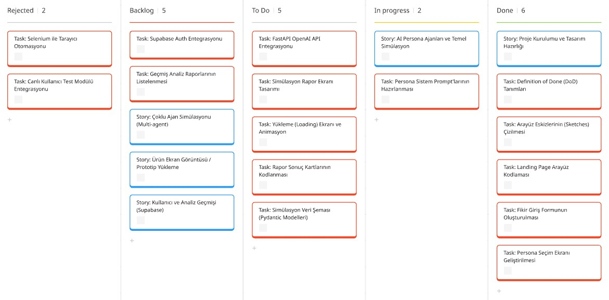
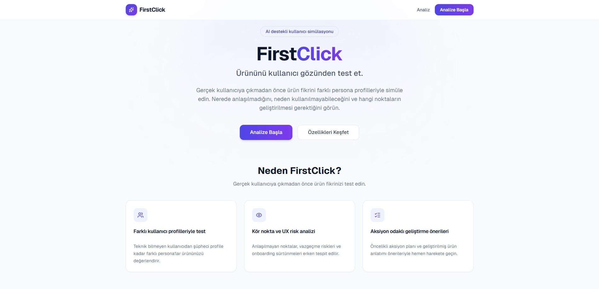
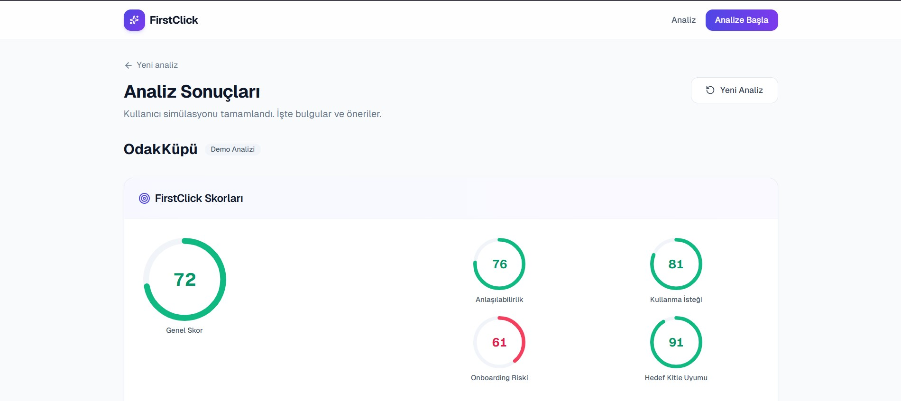
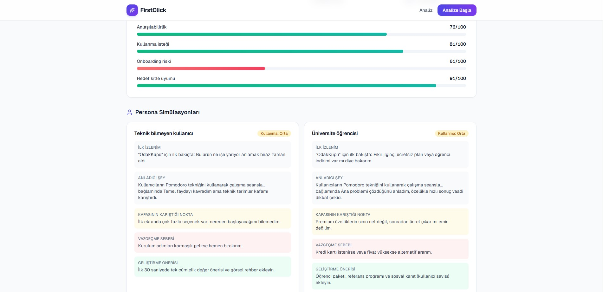
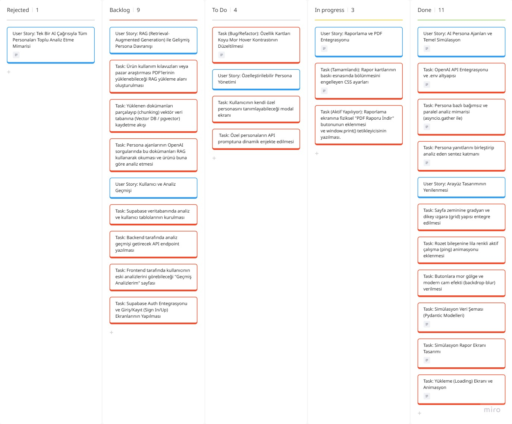
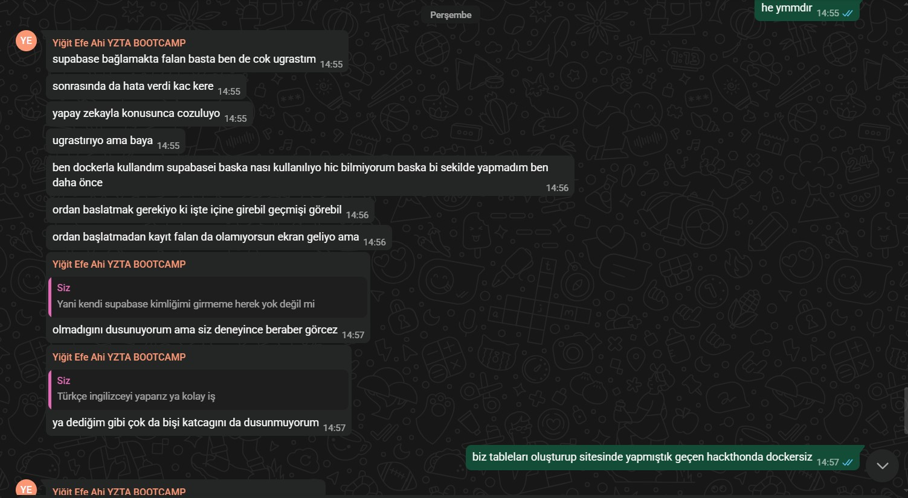
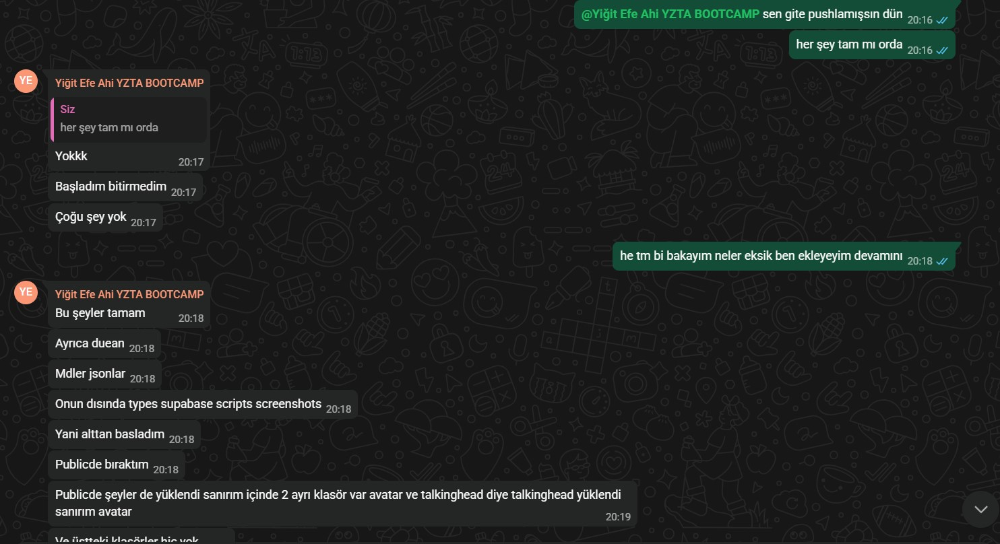
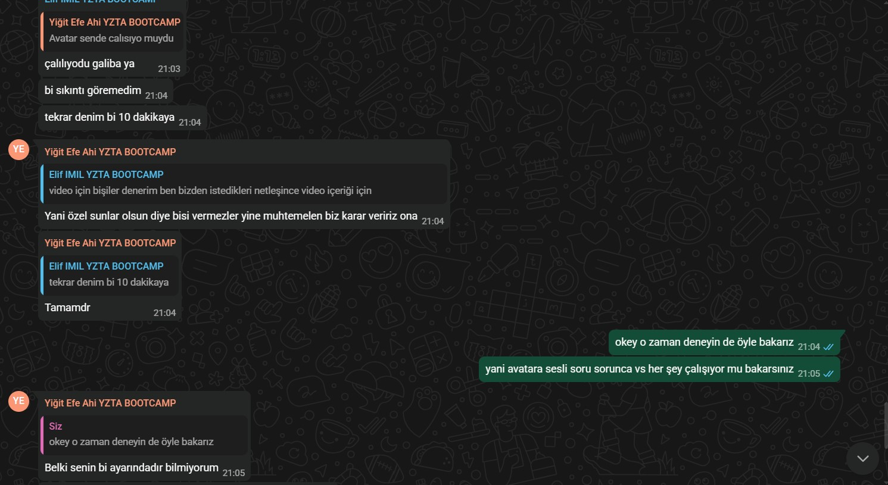
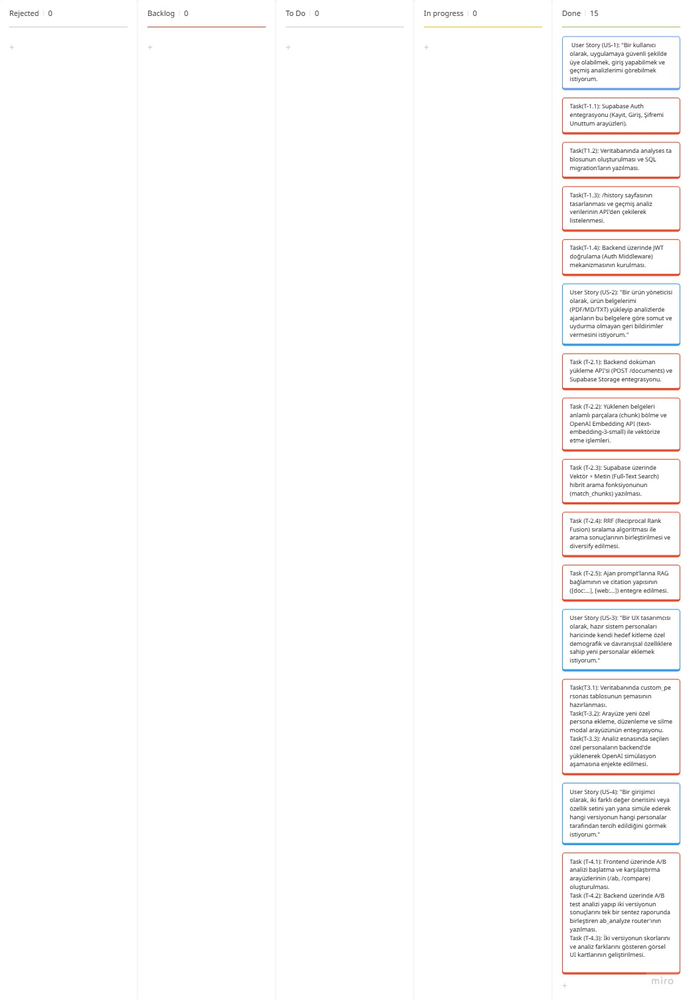
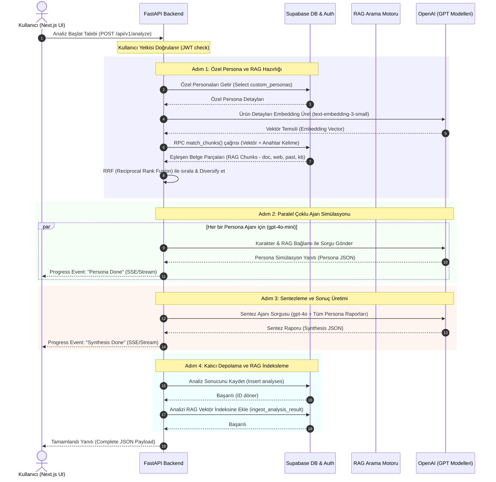

# **Takım İsmi**
Grup 15

---

# **Ürün İle İlgili Bilgiler**

## 👥 **Takım Elemanları**

| Profil | İsim | Rol | GitHub |
| :---: | :--- | :--- | :--- |
|  | **Yiğit Efe AHİ** | Scrum Master | [@yigitefeahi](https://github.com/yigitefeahi) |
|  | **Mehmet TAT** | Product Owner | [@mexmettat](https://github.com/mexmettat) |
|  | **Hasibe AKDOĞAN** | Developer | [@hasibeakdogan](https://github.com/hasibeakdogan) |
|  | **Elif İMİL** | Developer | [@elim834](https://github.com/elim834) |
|  | **Sevdenur GÖKBULUT** | Developer | [@Sevdenurgokbulut](https://github.com/Sevdenurgokbulut) |

---

## **Ürün İsmi**

### **FirstClick**

> **Slogan:** *"Ürününü kullanıcı gözünden test et."*

---

## **Ürün Açıklaması**

**FirstClick**, ürün fikirlerini gerçek kullanıcıya sunmadan önce test etmeyi ve doğrulamayı sağlayan yapay zeka destekli bir kullanıcı simülasyonu platformudur. Girişimciler, ürün yöneticileri ve tasarımcılar; hedef kitle personalarını (üniversite öğrencisi, yoğun çalışan anne, teknik bilmeyen kullanıcı vb.) seçerek ürünlerinin değer önerisini, kullanıcı akışını ve olası engellerini yapay zeka ajanları (simüle edilmiş kullanıcılar) aracılığıyla test edip detaylıca analiz edebilirler. 

**Vurucu Özelliği:** Sadece fikir yorumlayan sıradan bir yapay zeka değil; persona ajanları, kullanıcı yolculuğu simülasyonu, UX risk analizi, onboarding önerisi ve feedback hafızası barındıran gerçekçi bir kullanıcı testi simülasyon laboratuvarıdır.

---

## ✨ **Ürün Özellikleri**

- **AI Destekli Persona Simülasyonu:** Farklı demografik, sosyal ve davranışsal özelliklere sahip kullanıcı personaları oluşturma ve seçme.
- **Kullanıcı Akışı Analizi (User Flow Testing):** Belirli senaryolar ve hedefler doğrultusunda simüle edilen kullanıcıların uygulama içindeki adımlarını izleme.
- **Engeller ve Değer Önerisi Tespiti:** Sanal kullanıcıların nerede zorlandığını, hangi özellikleri gereksiz bulduğunu veya hangi onboarding modelinin daha iyi çalışacağını analiz etme.
- **Hızlı Fikir Doğrulama:** Kod yazma ve yayına alma aşamalarından önce fikirlerin pazar ve kullanılabilirlik açısından zayıf ve güçlü yanlarını raporlama.

---

## 🎯 **Hedef Kitle**

- **Girişimciler ve Startup Kurucuları:** Fikirlerini kod yazmadan ve büyük bütçeler harcamadan önce hızlıca doğrulamak (validate etmek) isteyenler.
- **Ürün Yöneticileri (Product Managers):** Yeni özellikleri ve kullanıcı akışlarını test ederek UX risk analizleri yapmak isteyen profesyoneller.
- **UX/UI Tasarımcıları:** Tasarımların ve onboarding süreçlerinin farklı kullanıcı personaları (teknik bilmeyenler, şüpheci müşteriler vb.) üzerindeki etkisini ölçmek isteyen tasarım ekipleri.
- **Yazılım & Tasarım Ajansları:** Müşterilerine sunacakları projelerin kullanıcı deneyimini (UX) önceden raporlayıp geliştirmek isteyen ajanslar.

---

## 📌 **Product Backlog URL**

🔗 [Miro Backlog Board](https://miro.com/app/board/uXjVH_yynQ4=/?share_link_id=164763609994)

---

# Sprint 1

- **Backlog Düzeni ve Story Seçimleri**: Backlog'umuz ilk yapılacak story'lere göre düzenlenmiştir. Sprint başına tahmin edilen puan sayısını geçmeyecek şekilde sıradan seçimler yapılmaktadır. Story başına çıkan tahmin puanı, toplam puanın yarısından az tutulmuştur.
  
  Story'ler yapılacak işlere (task'lere) bölünmüştür. Miro Board'da gözüken kırmızı item'lar yapılacak işleri (task) gösterirken, mavi item'lar story'leri temsil etmektedir.

- **Daily Scrum**: Daily Scrum toplantılarının zamansal sebeplerden ötürü Slack / Whatsapp üzerinden yapılmasına karar verilmiştir. Daily Scrum toplantısı ekran görüntüleri aşağıda paylaşılmaktadır:

  <p align="center">
    
    
    
    
  </p>

- **Sprint Board Update**: Miro panomuzda kullanılan kart renk kodları ve Story Point (SP) dağılımları aşağıda açıklanmıştır:
  - 🔵 **Mavi Kartlar**: User Story (Kullanıcı Hikayesi)
  - 🔴 **Kırmızı Kartlar**: Task (Yapılacak Teknik İş)

  ### **Story Point (SP) Dağılımı ve Değerlendirme:**
  Projedeki tüm ana kullanıcı hikayelerinin (User Story) iş yükü ve zorluk dereceleri, toplamda **100 SP** olacak şekilde planlanmıştır. "Tek bir Story puanı, toplam puanın yarısından (50 SP) az olmalıdır" kuralına sadık kalınmıştır:
  - 🔵 **Proje Kurulumu ve Tasarım Hazırlığı**: **15 SP** *(Done)*
  - 🔵 **AI Persona Ajanları ve Temel Simülasyon**: **30 SP** *(In Progress / To Do)*
  - 🔵 **Simülasyon Rapor Ekranı ve Raporlama**: **20 SP** *(To Do)*
  - 🔵 **Çoklu Ajan Simülasyonu (Multi-agent)**: **15 SP** *(Backlog)*
  - 🔵 **Ürün Ekran Görüntüsü / Prototip Yükleme**: **10 SP** *(Backlog)*
  - 🔵 **Kullanıcı ve Analiz Geçmişi (Supabase)**: **10 SP** *(Backlog)*
  - **Toplam Backlog Puanı**: **100 SP**

  ### **Miro Sprint Board Görünümü:**
 

- **Ürün Durumu**: Sprint 1 sonunda geliştirilen çalışan ürün ekran görüntüleri:

  #### 🔍 Giriş Ekranı (Landing Page)
  

  #### 📊 Analiz Ekranı (Analyze)
  

  #### 📈 Sonuç Ekranı (Results)
  

  #### ⚙️ API Dokümantasyonu (FastAPI Swagger)
  


- **Sprint Review**:
  - **Katılımcılar**: Bütün takım üyeleri.
  - **Sunulan Özellikler**: Sprint 1 kapsamında tamamlanan tüm kullanıcı hikayeleri (story) ve teknik geliştirmeler.
  - **Geri Bildirimler**: Ürün sahibi ve paydaşlardan alınan dönütler.
  - **Kararlar**: Sonraki sprint hedeflerine yönelik düzenlemeler.

- **Sprint Retrospective**:
  - **Neler İyi Gitti?**:
    - Next.js (Frontend) ve FastAPI (Backend) proje altyapısı hızlıca kurularak entegre edildi.
    - Mock API altyapısı ve hazırlanan tasarımlar sayesinde frontend ve backend geliştirme süreçleri paralel ve verimli ilerledi.
    - Miro panosu üzerinden görev dağılımları ve Story Point planlaması gerçekçi bir şekilde yapıldı.
  - **Neler Geliştirilebilir?**:
    - Daily Scrum takibi Whatsapp/Slack üzerinden yapılmasına rağmen zaman zaman paylaşımlarda gecikmeler yaşandı. Güncellemelerin daha disiplinli yapılması sağlanabilir.
    - Git branch yönetimi ve kod gözden geçirme (Code Review) süreçlerine daha fazla odaklanılabilir.
  - **Aksiyon Planları**:
    - Daily Scrum güncellemeleri her sabah en geç saat 11:00'e kadar ortak kanaldan standart bir şablonla paylaşılacak.
    - Büyük değişiklikler yerine daha küçük ve odaklanmış PR'lar (Pull Request) açılacak.
    - Sprint 2'deki Supabase entegrasyonu ve gerçek OpenAI servis bağlantıları için teknik ön araştırmalar (Spike) sprint başında tamamlanacak.


---

# Sprint 2

- **Backlog Düzeni ve Story Seçimleri**: Sprint 2 kapsamında, projenin temel yapay zeka analiz motorunun gelişmiş çoklu persona mimarisine geçirilmesi ve kullanıcı deneyiminin (UI/UX) iyileştirilmesi önceliklendirilmiştir. İşler, kullanıcı hikayelerine (User Story - Mavi Kartlar) ve bunlara bağlı teknik görevlere (Task - Kırmızı Kartlar) bölünmüştür.

- **Daily Scrum**: Daily Scrum toplantıları planlandığı gibi Slack / Whatsapp üzerinden sürdürülmektedir. Ekran görüntüleri aşağıdaki alana eklenecektir:

  <p align="center">
    
    
    
    
    
  </p>

- **Sprint Board Update**: Miro panomuzda Sprint 2 hedefleri doğrultusunda kartların güncel dağılımı yapılmıştır.
  - 🔵 **Mavi Kartlar**: User Story (Kullanıcı Hikayesi)
  - 🔴 **Kırmızı Kartlar**: Task (Yapılacak Teknik İş)

  ### **Story Point (SP) Dağılımı ve Değerlendirme:**
  Sprint 2'de toplam iş yükünü dengelemek adına aşağıdaki story point planlaması uygulanmıştır:
  - 🔵 **AI Persona Ajanları ve Temel Simülasyon**: **30 SP** *(Done)*
  - 🔵 **Arayüz Tasarımının Yenilenmesi**: **15 SP** *(Done)*
  - 🔵 **Raporlama ve PDF Entegrasyonu**: **20 SP** *(In Progress)*
  - 🔵 **Özelleştirilebilir Persona Yönetimi**: **15 SP** *(To Do)*
  - 🔵 **Kullanıcı ve Analiz Geçmişi (Supabase & Auth)**: **20 SP** *(Backlog - Sprint 3)*
  - 🔵 **RAG (Retrieval-Augmented Generation) Entegrasyonu**: **25 SP** *(Backlog - Sprint 3)*

  ### **Miro Sprint Board Görünümü:**
  

- **Ürün Durumu**: Sprint 2 kapsamında geliştirilen ve güncellenen çalışan ürün ekran görüntüleri:

  #### 🔍 Yenilenen Giriş ve Form Arayüzü
  <p align="center">
    
    
  </p>

  #### ⚙️ Özelleştirilebilir Persona Yönetimi (Modal Arayüzü)
  <p align="center">
    
    
  </p>

  #### 📄 Raporlama Ekranı & PDF Çıktı Desteği
  <p align="center">
    
    
  </p>

  🔗 **Oluşturulan Örnek PDF Raporu:** [OdakKüpü_sp2.pdf (screenshoots/OdakKüpü_sp2.pdf)](screenshoots/OdakKüpü_sp2.pdf)

- **Sprint Review**:
  - **Katılımcılar**: Bütün takım üyeleri.
  - **Sunulan Özellikler**: Sprint 2 kapsamında tamamlanan çoklu persona mimarisi, arayüz iyileştirmeleri, PDF baskı şablonu hazırlıkları ve yeni eklenecek olan özelleştirilebilir persona özellikleri.
  - **Geri Bildirimler**: Alınan dönütler doğrultusunda Sprint 3 planlaması.
  - **Kararlar**: Supabase Auth ve Veritabanı entegrasyonunun Sprint 3 planında önceliklendirilmesine karar verilmiştir.

- **Sprint Retrospective**:
  - **Neler İyi Gitti?**:
    - Çoklu persona simülasyonu için paralel çalışan backend altyapısı başarıyla kuruldu.
    - Tasarım pastel mor temaya uyarlanarak görsel bütünlük sağlandı.
  - **Neler Geliştirilebilir?**:
    - İşlerin bağımlılık analizi (dependency mapping) daha erken yapılabilirdi. Örneğin veritabanı geçmişinin kullanıcı girişine (Auth) doğrudan bağlı olduğunu planlama aşamasında gözden kaçırdığımız için sonradan planı revize etmek durumunda kaldık.
    - Tasarım aşamasında karanlık ve hover durumları gibi durumların okunabilirlik (kontrast) testleri geliştirme aşamasında daha erken fark edilebilirdi (Örn: Özellik kartlarının hover esnasında metin okunabilirliği sorunu).
  - **Aksiyon Planları**:
    - Sprint 3'teki Supabase Auth ve Veritabanı geliştirmelerine başlamadan önce şema tasarımı ve akış diyagramı (flowchart) çizilerek tüm takımın hizalanması sağlanacak.
    - PR (Pull Request) kabul kriterlerine görsel arayüz kontrollerini (özellikle hover, focus ve responsive durumları) test etme kriteri eklenecek.
    - Daily Scrum takibindeki disiplin (her sabah saat 11:00 standardı) Sprint 3'te de aynı kararlılıkla sürdürülecek.


---

# Sprint 3

- **Backlog Düzeni ve Story Seçimleri**: Sprint 3 kapsamında, projenin güvenlik, veritabanı kalıcılığı, döküman bazlı RAG motoru entegrasyonu ve gelişmiş analiz özellikleri tamamlanmıştır. İşler kullanıcı hikayelerine (User Story - Mavi Kartlar) ve bunlara bağlı teknik görevlere (Task - Kırmızı Kartlar) bölünmüş; Miro üzerinde planlanan hedeflere sadık kalınmıştır.

- **Daily Scrum**: Daily Scrum toplantıları Slack ve Whatsapp üzerinden yürütülmüş, ekip üyeleri her gün saat 11:00'e kadar ilerlemelerini ve olası engellerini paylaşmıştır. Ekran görüntüleri aşağıdaki alanlara eklenecektir:

  <p align="center">
    
    
    
  </p>

- **Sprint Board Update**: Miro panomuzda Sprint 3 hedefleri doğrultusunda kartların son durumu güncellenmiş ve backlog tamamlanmıştır.
  - 🔵 **Mavi Kartlar**: User Story (Kullanıcı Hikayesi)
  - 🔴 **Kırmızı Kartlar**: Task (Yapılacak Teknik İş)

  ### **Story Point (SP) Dağılımı ve Değerlendirme:**
  Sprint 3'te projenin ana fazını bitirmek üzere 100 SP'lik nihai iş planlaması gerçekleştirilmiştir:
  - 🔵 **Kullanıcı ve Analiz Geçmişi (Supabase & Auth)**: **20 SP** *(Done)*
  - 🔵 **RAG (Retrieval-Augmented Generation) Entegrasyonu**: **25 SP** *(Done)*
  - 🔵 **Özelleştirilebilir/Kullanıcı Tanımlı Persona Yönetimi**: **15 SP** *(Done)*
  - 🔵 **A/B Test Analiz Karşılaştırma Arayüzü**: **15 SP** *(Done)*
  - 🔵 **TTS Sesli Okuma Entegrasyonu & Paylaşım Özelliği**: **15 SP** *(Done)*
  - 🔵 **Belge/Doküman Yönetim Sistemi & Workspace Mimarisi**: **10 SP** *(Done)*
  - **Toplam Backlog Puanı**: **100 SP**

  ### **Miro Sprint Board Görünümü:**
  

- **Ürün Durumu**: Sprint 3 kapsamında geliştirilen ve kullanıma sunulan çalışan ürün ekran görüntüleri:

  #### 🔐 Giriş / Kayıt Arayüzü ve Kullanıcı Geçmişi
  <p align="center">
    
    
  </p>

  #### 📚 Doküman Yükleme ve Hibrit RAG Yönetimi
  <p align="center">
    
    
  </p>

  #### ⚖️ A/B Test Karşılaştırma Arayüzü
  <p align="center">
    
    
  </p>

  #### 🎙️ TTS (Text-to-Speech) Sesli Persona Dinleme & Analiz Paylaşımı
  <p align="center">
    
    
  </p>

- **Sprint Review**:
  - **Katılımcılar**: Bütün takım üyeleri.
  - **Sunulan Özellikler**: Supabase Authentication, analiz geçmişi veritabanı, RAG motoru (PDF/MD/TXT desteği), özelleştirilebilir persona ekleme/çıkarma, A/B testi analiz karşılaştırma arayüzü, TTS sesli persona sentezi ve analiz paylaşım linkleri.
  - **Geri Bildirimler**: Ürün sahibi ve paydaşlar, yapay zeka ajanlarının ürün dokümanlarını (RAG) kullanarak çok daha spesifik ve uydurma olmayan geri bildirimler vermesini oldukça başarılı buldu. A/B test karşılaştırma özelliği ise ürün geliştirme ekiplerinin iterasyonlarını ölçümlemesi için kritik bir katma değer olarak değerlendirildi.
  - **Kararlar**: Proje başarıyla MVP (Minimum Viable Product) aşamasından tam kapsamlı bir analiz platformuna taşınmış ve canlıya alınmaya hazır hale getirilmiştir.

- **Sprint Retrospective**:
  - **Neler İyi Gitti?**:
    - Supabase Auth ve RAG altyapısı beklenenden hızlı kuruldu; veritabanı şema tasarımı önceden netleştirildiği için backend ve frontend entegrasyonu pürüzsüz ilerledi.
    - Ajan simülasyonlarında OpenAI'ın paralel çağrılması sayesinde analiz süreleri optimize edildi.
    - TTS seslendirme özelliği simüle edilmiş kullanıcıların iç sesini dinleme deneyimini zenginleştirdi.
  - **Neler Geliştirilebilir?**:
    - RAG retrieval aşamasındaki embedding çıkarma maliyetleri ve token limitleri için daha sıkı korumalar/cache katmanları eklenebilirdi.
    - Büyük PDF belgelerinin ayrıştırılması ve indekslenmesi sırasında yaşanan gecikmeler için bir arka plan kuyruk yapısı (Celery/Redis vb.) kurulması gelecekte düşünülebilir.
  - **Aksiyon Planları**:
    - Canlıya alım sonrasında veritabanı sorguları ve vektör aramaları için index optimizasyonları yapılacak.
    - API token harcamalarını izlemek ve bütçe aşımını önlemek için bir kullanım limiti/kota kontrol sistemi kurulacak.


---

# Teknik Kurulum ve Mimari

> [!NOTE]
> Projenin teknik kurulumu, çalıştırma adımları ve mimari detayları aşağıda yer almaktadır.

## Mimari Yapı

| Katman | Teknoloji | Port |
|--------|-----------|------|
| **Frontend** | Next.js 14, TypeScript, Tailwind | `3000` |
| **Backend** | FastAPI, Python | `8000` |

Frontend yalnızca UI sunar. Tüm analiz mantığı, OpenAI entegrasyonu ve mock fallback **ayrı backend servisinde** çalışır.

```
Frontend (Next.js)  ──POST──▶  Backend (FastAPI)  ──▶  OpenAI / Mock
     :3000                         :8000
```

### Ajan Orkestrasyonu İşleyiş Şeması

FirstClick platformunda çalışan karmaşık çoklu ajan simülasyonu ve hibrit RAG akışının zaman diyagramı aşağıda gösterilmiştir:


```mermaid
sequenceDiagram
    autonumber
    actor User as Kullanıcı (Next.js UI)
    participant API as FastAPI Backend
    participant DB as Supabase DB & Auth
    participant RAG as RAG Arama Motoru
    participant LLM as OpenAI (GPT Modelleri)

    User->>API: Analiz Başlat Talebi (POST /api/v1/analyze)
    Note over API: Kullanıcı Yetkisi Doğrulanır (JWT check)
    
    rect rgb(240, 240, 255)
        Note over API, DB: Adım 1: Özel Persona ve RAG Hazırlığı
        API->>DB: Özel Personaları Getir (Select custom_personas)
        DB-->>API: Özel Persona Detayları
        
        API->>LLM: Ürün Detayları Embedding Üret (text-embedding-3-small)
        LLM-->>API: Vektör Temsili (Embedding Vector)
        
        API->>DB: RPC match_chunks() çağrısı (Vektör + Anahtar Kelime)
        DB-->>API: Eşleşen Belge Parçaları (RAG Chunks - doc, web, past, kb)
        API->>API: RRF (Reciprocal Rank Fusion) ile sırala & Diversify et
    end

    rect rgb(245, 255, 245)
        Note over API, LLM: Adım 2: Paralel Çoklu Ajan Simülasyonu
        par Her bir Persona Ajanı için (gpt-4o-mini)
            API->>LLM: Karakter & RAG Bağlamı ile Sorgu Gönder
            LLM-->>API: Persona Simülasyon Yanıtı (Persona JSON)
            API-->>User: Progress Event: "Persona Done" (SSE/Stream)
        end
    end

    rect rgb(255, 245, 240)
        Note over API, LLM: Adım 3: Sentezleme ve Sonuç Üretimi
        API->>LLM: Sentez Ajanı Sorgusu (gpt-4o + Tüm Persona Raporları)
        LLM-->>API: Sentez Raporu (Synthesis JSON)
        API-->>User: Progress Event: "Synthesis Done" (SSE/Stream)
    end

    rect rgb(240, 255, 255)
        Note over API, DB: Adım 4: Kalıcı Depolama ve RAG İndeksleme
        API->>DB: Analiz Sonucunu Kaydet (Insert analyses)
        DB-->>API: Başarılı (ID döner)
        API->>DB: Analizi RAG Vektör İndeksine Ekle (ingest_analysis_result)
        DB-->>API: Başarılı
    end

    API-->>User: Tamamlandı Yanıtı (Complete JSON Payload)
```

## Kurulum ve Çalıştırma

```bash
cd firstclick
make install
```

### Backend Ortam Değişkenleri
`backend/.env` dosyasını oluşturun (`backend/.env.example` referans):

```bash
OPENAI_API_KEY=sk-...
OPENAI_MODEL=gpt-4o-mini
OPENAI_SYNTHESIS_MODEL=gpt-4o
OPENAI_EMBEDDING_MODEL=text-embedding-3-small
CORS_ORIGINS=http://localhost:3000,http://127.0.0.1:3000
SUPABASE_URL=https://YOUR_PROJECT.supabase.co
SUPABASE_SERVICE_ROLE_KEY=...
SUPABASE_JWT_SECRET=...
SUPABASE_STORAGE_BUCKET=product-docs
```

### Frontend Ortam Değişkenleri
`.env.local` dosyasını oluşturun:

```bash
NEXT_PUBLIC_API_BASE=http://127.0.0.1:8000
NEXT_PUBLIC_SUPABASE_URL=https://YOUR_PROJECT.supabase.co
NEXT_PUBLIC_SUPABASE_ANON_KEY=...
```

Supabase SQL migration: `supabase/migrations/001_init.sql`  
Deploy (Render): [DEPLOY.md](DEPLOY.md)

### Projeyi Çalıştırma
İki ayrı terminal açarak aşağıdaki komutları çalıştırın:

```bash
make run-backend   # http://127.0.0.1:8000 adresinde çalışır
make run-frontend  # http://localhost:3000 adresinde çalışır
```

Giriş: `/login` · Kayıt: `/signup` · Geçmiş: `/history`  
Analiz için giriş zorunludur. Doküman (PDF/MD/TXT) yükleyerek hibrit RAG (doküman + geçmiş analiz) aktif edilir.

API dokümantasyonuna [http://127.0.0.1:8000/docs](http://127.0.0.1:8000/docs) adresinden erişebilirsiniz.


## Proje Klasör Yapısı

### Backend Yapısı
```text
backend/
  app/
    main.py              # FastAPI uygulaması, CORS
    config.py            # Ortam ayarları
    constants.py         # Persona tanımları
    routers/
      analyze.py         # POST /api/v1/analyze
      health.py          # GET /health
    schemas/
      analysis.py        # Pydantic modelleri
    services/
      analyze.py         # Analiz orchestrator
      mock_analyzer.py   # Kişiselleştirilmiş mock
      openai_analyzer.py # OpenAI entegrasyonu
  requirements.txt
```

### Frontend Yapısı
```text
app/           # Sayfalar (landing, analyze, results)
components/    # UI bileşenleri
lib/api.ts     # Backend API client
types/         # TypeScript tipleri
```

## Gelecek Geliştirmeler

- **Vision LLM Ajanları (Multimodal):** Ürün ekran görüntüsü, mockup veya doğrudan Figma tasarımlarını görsel olarak tarayıp analiz edebilecek tasarım ajanlarının entegrasyonu.
- **Chrome Extension / Widget Desteği:** Kullanıcıların FirstClick panelinden çıkmadan, kendi canlı web siteleri veya prototipleri üzerinde ajanları çalıştırabileceği bir tarayıcı eklentisi.
- **Gelişmiş Caching & API Limit Kontrolü:** Tekrarlanan analiz adımları için Redis cache katmanı eklenmesi ve kurumsal müşteriler için API kullanım kota/bütçe yönetim paneli.
- **Detaylı Demografik Veri Entegrasyonu:** Özel personalar oluştururken hedeflenen lokasyon, yaş ve meslek gruplarına uygun hazır davranış profili modellerinin (demographic presets) sisteme dahil edilmesi.


